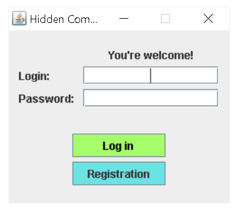
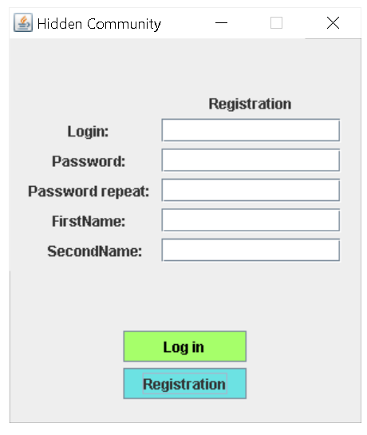
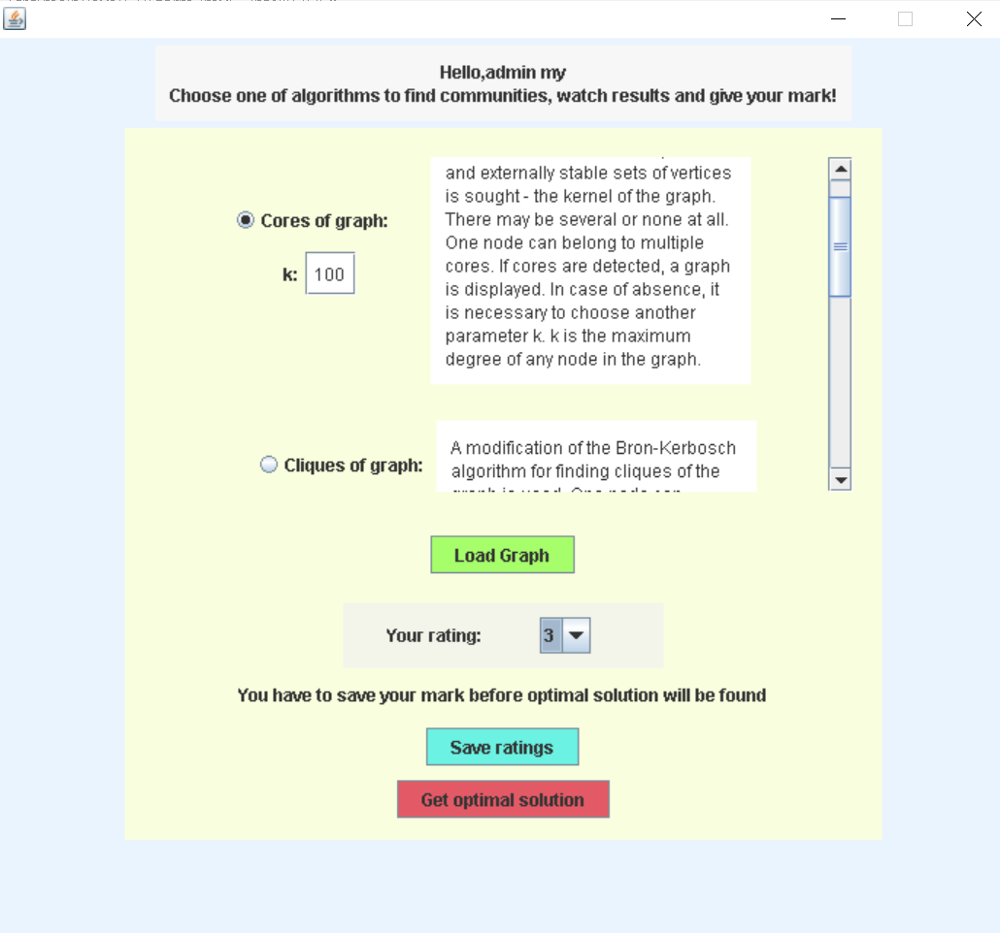
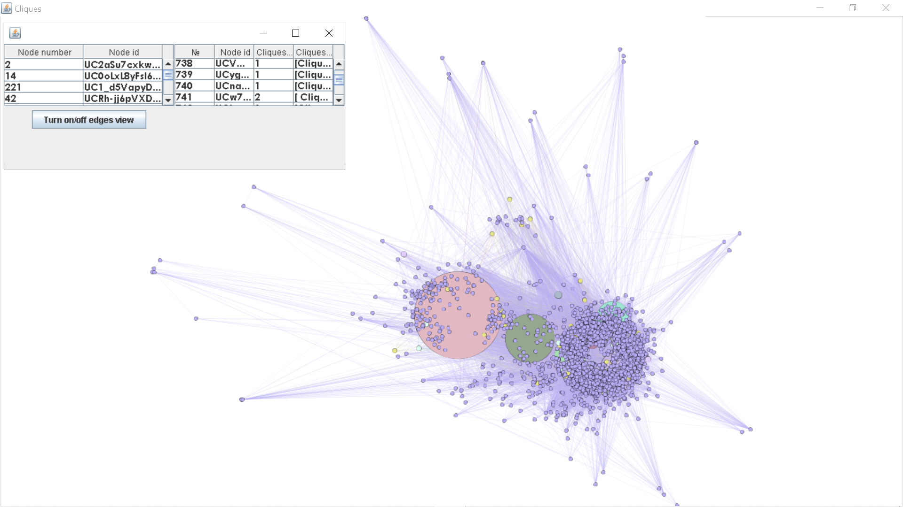
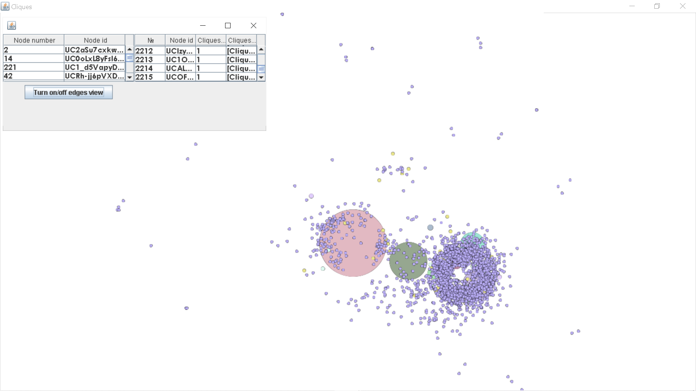

# AgentsInterface
 The interface of agents for algorithms analyze that help to find hidden communities of YouTube social network
 
 ## Tool Stack  
 Java, JavaFX, Gephi, PostgreSQL
 ## Opportunities
 ##### Firstly, you have to log in:
 
 ##### If you haven't an account, you can create new one:
  
 ##### You can see results of 4 algorithms and give it rating:
 
 
 ##### The results can be watching with or without edges:
 
 